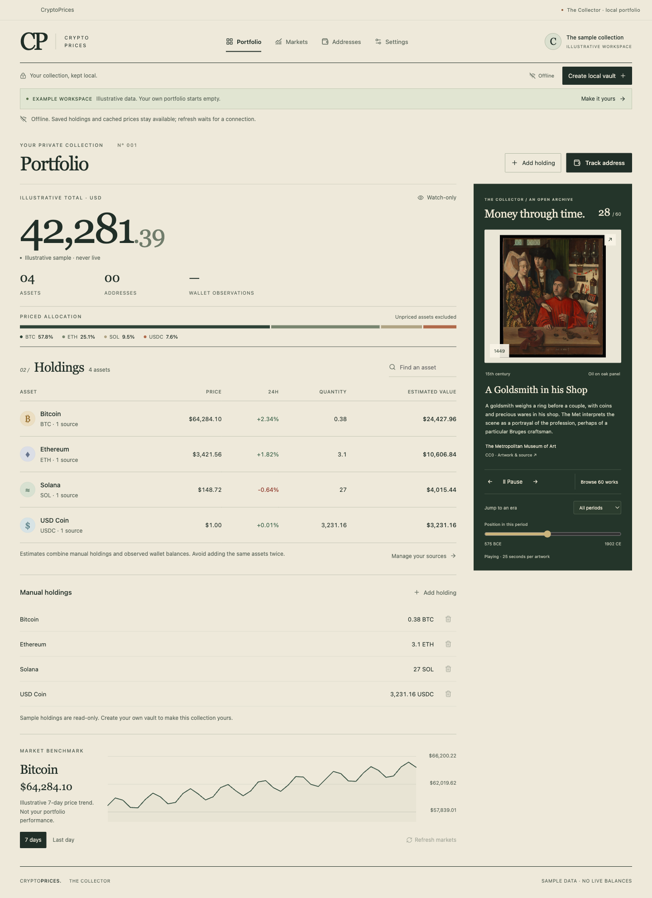

# CryptoPrices

A local-first, watch-only cryptocurrency portfolio for the desktop. Create a local profile, track public wallet addresses or manual holdings, and browse cached market observations without a cloud account.

CryptoPrices began as my university final-year project in 2018. This 2026 rebuild preserves that project and its Git history while replacing its Firebase dependency, authentication model, storage and development tooling. The engineering focus is explicit data ownership, a responsive desktop boundary, and honest reporting of incomplete financial data.

**The Collector** pairs an editorial portfolio ledger with a rotating history of money: 60 public-domain and CC0 museum works, bundled for offline use. The desktop application supports macOS first, with Windows/Linux build checks configured in CI. See [verification](docs/verification.md) for what has actually been tested and the remaining distribution checks.



## What it does

- Registers and unlocks local profiles offline, with personal data encrypted before it reaches SQLite.
- Stores watch-only addresses, manual asset quantities, watchlists and cached observations on the device.
- Requests up to the top 1,000 market assets from CoinGecko, including available price changes and real price sparklines.
- Reads supported native and token balances on explicit refresh, preserving quantities as exact decimal strings.
- Records observation times, scan coverage and failures. Unavailable prices or balances remain unknown.
- Exports a consistent database backup containing encrypted personal records.

The app has no cloud identity service, telemetry, wallet connection, transaction signing or trading. It never needs a seed phrase or private key. Market price changes are not personal profit or loss: the app does not reconstruct portfolio performance, transaction history, acquisition cost or tax records.

## Run locally

Use **Node.js 24**, version **24.14.0 or later within the 24.x line**, and npm. The lockfile pins the dependency versions; a supported runtime matters because storage uses Node's built-in SQLite API.

```sh
git clone https://github.com/nen-io/CryptoPrices.git
cd CryptoPrices
npm ci
npm run dev
```

Dependency installation requires internet access. Local registration, unlocking and saved-data access do not. A first installation has no live market cache until an explicit refresh succeeds. CoinGecko works without an embedded shared key; an optional personal Demo API key can be configured.

| Command | Purpose |
| --- | --- |
| `npm run artwork:check` | Validate all 60 local works and their provenance |
| `npm run typecheck` | Check the TypeScript and Vue contracts |
| `npm test` | Run deterministic unit and integration tests |
| `npm run build` | Build the desktop application |
| `npm run check` | Run type checking, tests and the build |
| `npm run test:e2e` | Build and run the Electron interaction tests |
| `npm run package:dir` | Produce an unpacked application for the host platform |
| `npm run package` | Run checks and create the configured host-platform packages |

Build output goes to `out/`; packaging output goes to `release/`. Packaging does not publish a release. macOS uses an ad-hoc signature by default; public distribution needs Developer ID signing and notarization. The [GitHub Actions workflow](.github/workflows/desktop.yml) checks and packages macOS, Windows and Linux, including native Electron interaction tests on macOS. The optional [GitLab pipeline](.gitlab-ci.yml) remains available for mirrors. See [CI setup](docs/ci.md) and actual workflow results before treating a platform as verified.

## Wallet coverage

| Network | Implemented observations |
| --- | --- |
| Bitcoin mainnet | Confirmed BTC for the supplied address |
| Ethereum | ETH and catalogue ERC-20 contracts |
| Base | ETH and catalogue ERC-20 contracts |
| Arbitrum One | ETH and catalogue ERC-20 contracts |
| OP Mainnet | ETH and catalogue ERC-20 contracts |
| Polygon PoS | POL and catalogue ERC-20 contracts |
| BNB Smart Chain | BNB and catalogue ERC-20 contracts |
| Avalanche C-Chain | AVAX and catalogue ERC-20 contracts |
| Solana mainnet | Liquid SOL and owned SPL / Token-2022 accounts |

Top-1,000 **market coverage is not universal wallet coverage**. EVM token discovery uses exact contract mappings for assets in the cached market catalogue, bounded to 1,000 contracts per network scan. Solana also retains unlisted mints without assigning invented prices. Other blockchains, Bitcoin change-address discovery, Lightning, DeFi positions, staking accounts and full NFT support are outside this implementation.

Pagination changes, rate limits, stale catalogues and failed contract reads can produce partial results. Estimated totals must be read alongside their missing-price and incomplete-scan indicators. Full details, fixed endpoints and live verification notes are in [Provider coverage](docs/providers.md).

## Architecture and tradeoffs

The stack is **Electron 44, Vue 3, TypeScript 6 and SQLite**, built with electron-vite. A sandboxed renderer uses a narrow typed preload bridge. Electron main owns desktop lifecycle and validates callers; a worker handles storage, passphrase derivation and provider requests. Synchronous SQLite work stays away from the UI and main event loops.

Responsiveness comes from bounded rendering and network work, sampled real chart data and explicit refreshes. Electron provides a consistent rendering engine and desktop lifecycle at the cost of a larger runtime than system-webview alternatives. Performance claims require measurements on the packaged application; animation quality alone is not evidence of low memory or CPU use.

Personal documents use AES-256-GCM with random per-profile keys wrapped by a scrypt-derived passphrase key. This is encrypted-record storage, not whole-file database encryption: profile names and public market caches remain visible. There is no remote password reset. Keep a backup and its passphrase; encryption does not protect an unlocked app from a compromised operating system.

Adding an address is offline. Refreshing it discloses the public address and the caller's IP address to the named provider: Blockstream for Bitcoin, PublicNode for EVM networks, or Solana's public RPC. Market requests go to CoinGecko. There is no silent provider fallback or arbitrary RPC configuration.

- [Architecture](docs/architecture.md): process boundaries, concurrency and runtime decisions.
- [Security](docs/security.md): threat model, encryption, locking, backup and recovery.
- [Providers](docs/providers.md): supported assets, privacy, precision and request limits.

## Art, motion and sample data

The gallery spans ancient coinage, trade and exchange, and engraved paper currency. Each work includes its museum attribution, date, material, historical caption and source/rights links. Browse all 60, select an era, step through the timeline, or let the gallery rotate every 25 seconds. It pauses while you read or interact, when hidden or off screen, and with reduced motion. Only the current work and next image load during normal playback. All artwork and fonts are local.

The cream, ink and olive interface keeps the ledger readable beside the artwork. Controls have text labels, keyboard focus, native dialogs and reduced-motion alternatives. A visibly labelled example workspace lets reviewers explore without creating a profile. Those values are illustrative; a real local vault starts empty and never inherits sample prices.

- [Artwork provenance](docs/artwork-provenance.md): every work and its reuse basis.
- [Design decisions](docs/design.md): the selected direction and archived studies.
- [Verification](docs/verification.md): executed checks and known limits.
